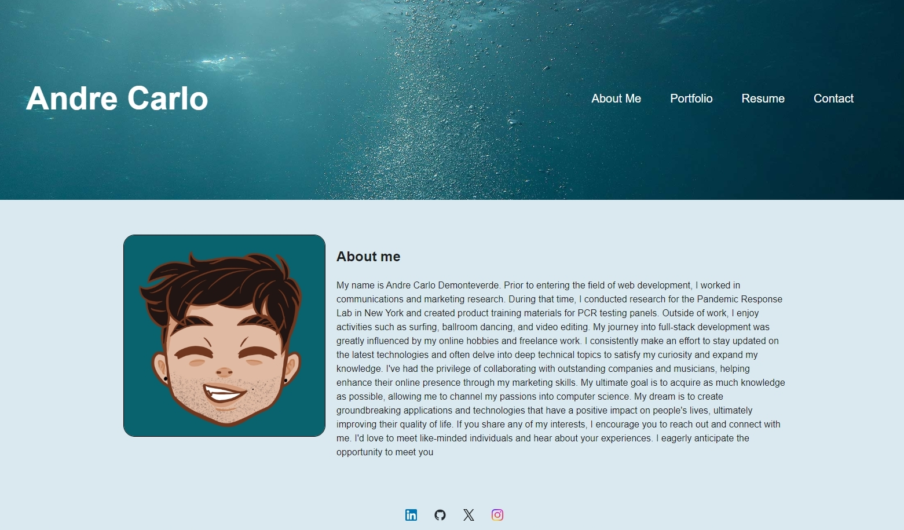
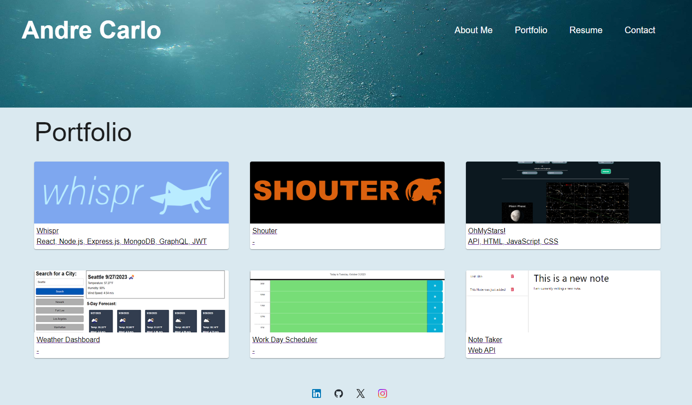

# React Portfolio

## Description

This project is a single-page React application designed to showcase a web developer's portfolio. It provides an interactive and visually appealing way to display a developer's work samples, contact information, and resume. 

## User Story

As an employer looking for candidates with experience building single-page applications, I want to view a potential employee's deployed React portfolio of work samples so that I can assess whether they're a good candidate for an open position.

## Assets

## Link to GitHub Repository:

[https://github.com/ademonteverde/react_portfolio](https://github.com/ademonteverde/react_portfolio)

## Link to deployed application:

## License

This project is licensed under the (MIT)[https://github.com/ademonteverde/react_portfolio/blob/main/LICENSE] License.